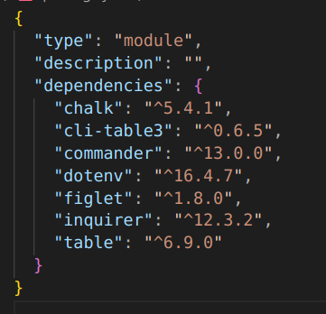

# ProductivityCLI

A CLI based task manager built using Node.js to help you manager your task from the terminal.

# Motivation

Recently, I revisited middleware concepts, Node.js, and its various applications. This exploration sparked an idea to build a CLI-based todo manager, which would help me become more familiar with working in the terminal environment. Undertaking this project has provided an opportunity to deepen my understanding and practical implementation of asynchronous JavaScript.

During the development process, I extensively explored the [npm](https://www.npmjs.com/) website to discover various libraries and understand their syntax and usage.  This project has been a significant motivation as I transition towards more front-end-heavy project. Understanding the challenges and limitations of developing software purely for terminal use, similar to how it was done decades ago, has given me valuable perspective on modern development practices.

Overall, working on this ProductivityCLI has been an enriching experience!!

## Built With

-- **Tech used:** 
HTML, JavaScript, Node

**Library used in node***



## Features
- Add, remove, update, markdone and list all the task in the list
- use of a clipanel to simultaneously mark multiple task as done or undone
- sort the task based on time and alphabtically
- User - friendly command line interface with colors.

## Get Started
Ensure you have the following installed on you system:

#### To install this application you need 

[Node JS 20.0 or above](https://nodejs.org/en/download/)


#### If Node.js and npm are installed, run:

```bash
# Check the current version of Node
node -v

# Check the current versin of npm
npm -v
```


## Build Setup
```bash
#Clone repo
git clone https://github.com/prayascittah/ProductivityCLI.git

# Install dependencies:
npm install

# Set up .env file in the project root:
touch .env

# Add the content inside .env
FILE_PATH=./jsonfiles/todo.json
CONFIG_PATH=./jsonfiles/config.json

# Run a test to check if everything works
node --experimental-modules src/todo.mjs ---help
```


## Usage
0. Format 

```bash
node --experimental-modules src/todo.mjs <commandName> <taskname> <timeRequired> <timeofday>
```

1. Add a task

```bash
node --experimental-modules src/todo.mjs add <taskname> <timeRequired> <timeofday>
```

2. Remove a task

```bash
node --experimental-modules src/todo.mjs remove <taskid> <taskname>
```

3. Check a task 
```bash
node --experimental-modules src/todo.mjs markdone <taskid> <taskname>
```

4. Update a task
```bash
node --experimental-modules src/todo.mjs update <taskid> <taskname>
```

5. sortby command
```bash
node --experimental-modules src/todo.mjs sortby -a <boolean> -t <boolean>
```

6. list all task
```bash
node --experimental-modules src/todo.mjs all
```

7. CLI-Panel (Interactive ClI - Panel)
```bash
node --experimental-modules src/todo.mjs clipanel
```

8. Help
```bash
node --experimental-modules src/todo.mjs --help | -h
```


#### TLDR;
```yaml
Usage: CliTodo <options> command

A CLI productivity tracker

Options:
  -v, --version                              display current version of command
  -h, --help                                 display help for command

Commands:
  add <taskName> <timeRequired> <timeOfDay>  Add a new task
  remove <taskid> <taskName>                 Remove a task
  markdone <taskid> <taskName>               check-off task from list
  update <taskid> <taskName>                 Update a task
  sortby [options]                           Sort tasks by either alphabetical order | time
  all                                        List all tasks
  clipanel                                   Interactive CLI panel
  help [command]                             display help for command
```


## License
This project is licensed under the [MIT License](LICENSE).
